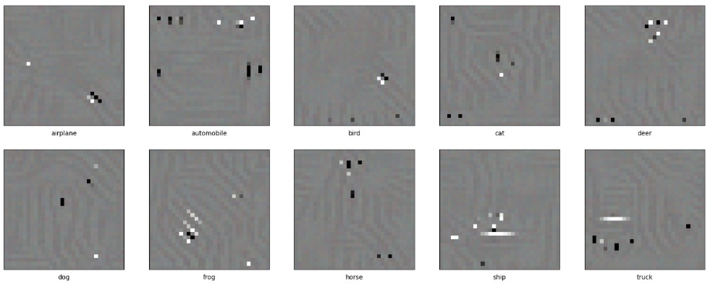

# <div align="center">CS612 AI Systems Evaluation Group 1: The Deep Fakers</div>
<div align="center">

[](https://www.python.org/)
[](https://pytorch.org/)
[](https://shields.io/)
</div>
<p align="center">
  
</p>

Keeping deep learning models honest through testing.
#### <ins>__Members__</ins><br>
[Chng Kian Woon Gerry](mailto:gerry.chng.2020@mitb.smu.edu.sg)<br>
[He Chen](mailto:chen.he.2020@mitb.smu.edu.sg)<br>
[Lim Hsien Yong](mailto:hy.lim.2021@mitb.smu.edu.sg)<br>
[Spencer Keith Marley](mailto:skmarley.2021@mitb.smu.edu.sg)<br>
  
## <div align="center">Project Directory Structure</div>
```
.
├── data
│   ├── MNIST/raw
│   ├── TriggerImg
│   ├── TriggerImg.zip
├── model tests         <- test functions to ascertain model backdoor/s
├── models              <- repository of model architectures
│   ├── benign   
│   ├── definitions
│   ├── subject
│   ├── train
├── notebooks           <- demonstration of model tests and functions
├── papers              <- papers referenced
├── trigger_clean       <- pt models
```
## <div align="center">Gallery of backdoors found</div>
#### <ins>__Backdoors from CIFAR10 subject model__</ins><br>
<p align="center">
  
</p>
